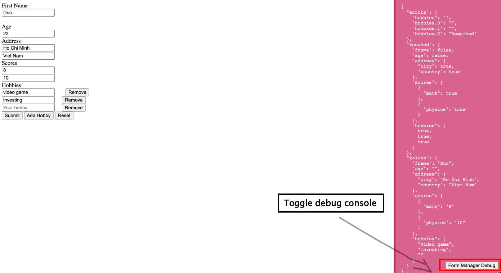

<div align="center">
  <h3 align="center">Vanilla Form Manager</h3>

  <p align="center">
   A Small Package to handle your HTML Form in vanilla JS
  </p>
</div>

## Getting Started

This is an example of how you may give instructions on setting up how to use the packages.

### Installation

- npm

  ```sh
  npm install vanilla-form-manager
  ```

- yarn
  ```sh
  yarn add vanilla-form-manager
  ```

## Note

The project is support TypeScript, so we recommended to used TypeScript to reduce mistake from typing.

# Usage

## Create a form instance

Create a simple instance of form

````md
```js
const initialValues = {
  fname: "Duc",
  age: "",
  address: {
    city: "",
    country: "",
  },
  scores: [{ math: "" }, { physics: "" }],
  hobbies: [""],
};

const myForm = new FormValidation({
  formId: "myForm",
  initialValues,
  validations: {
    fname: (value) => (!!value ? "" : "required"),
    age: (value) => (!!value ? "" : "required"),
    hobbies: (value) => (value.length > 1 ? "" : "at least 2 hobbies"),
    "hobbies._item": (value) => (!!value ? "" : "Required"),
  },
  onSubmit: (values) => {
    console.log("form submitted", values);
  },
});
```
````

- `formId` : is form ID that can be use later to interact with the form
- `initialValues`: initial values of the form
- `validations`: validation of the form, at currently we only support for single-field validate only (multiple fields with other packages will be in feature)
- `onSubmit`: callback on the form be submitted

## Debug the form

We currently support for debug mode to easier to track the form change. You can use it by adding `debug: true` into form config

````md
```js
const myForm = new FormValidation({
  // others config,
  debug: true,
});
```
````

- After set debug to `true`, you can use the toggle button at right bottom of screen to open the debug console



## Examples

You can come to

## FormValidation Config

- receive T as generic type FormValidation<T>, if T is not defined, T will automatically infer as initialValues type

| API              | Type                                                                                 | Detail                                     |
| ---------------- | ------------------------------------------------------------------------------------ | ------------------------------------------ |
| formId           | String                                                                               | form id of the form                        |
| initialValues    | Object                                                                               | default values of the form                 |
| validations      | Object of func(value) => string                                                      | defined validation of each field           |
| validateOnChange | Boolean                                                                              | enable validation on field change          |
| validateOnBlur   | Boolean                                                                              | enable validation on field blur            |
| onSubmit         | func(values: T)                                                                      | callback executed on form submitted        |
| onChange         | func(values: T)                                                                      | callback executed on form change           |
| onBlur           | func(values: T)                                                                      | callback executed on form blur             |
| renderError      | func(formState: FormState<T>,formEl: HTMLFormElement,formInputs: HTMLInputElement[]) | custom render error                        |
| watch            | Object of func(value, error, isTouched)                                              | config watch callback of each field change |
| debug            | Boolean                                                                              | enable debug console                       |

## FormValidation instance

| API              | Type                               | Detail                                                                      |
| ---------------- | ---------------------------------- | --------------------------------------------------------------------------- |
| initialValues    | T                                  | initial value get from config                                               |
| isFormValid      | Boolean                            | return `true` if the form has no error                                      |
| formState        | Object                             | contain all information of the form (included: `values`,`touched`,`errors`) |
| formElement      | HTMLFormElement                    | return form Element                                                         |
| resetForm        | func()                             | reset form value to initial value                                           |
| validateField    | func(fieldPath)                    | manual valid a field                                                        |
| validateForm     | func()                             | manual validate the form                                                    |
| renderFormValue  | func(value)                        | force form to render form again with new value                              |
| formValues       | Object                             | return form values                                                          |
| setFormValue     | func(value)                        | set form value                                                              |
| removeFormValue  | func(fieldPath)                    | remove a field value                                                        |
| getFieldValue    | func(fieldPath)                    | get field value                                                             |
| setFieldValue    | func({fieldPath, value})           | set field value                                                             |
| setFieldTouched  | func({fieldPath, touched})         | set field touch                                                             |
| getFieldTouched  | func(fieldPath)                    | get field touch                                                             |
| isFieldTouched   | (fieldPath) => boolean             | return is a field was touched or not                                        |
| formErrors       | Object                             | return form errors                                                          |
| removeFieldError | func(fieldPath)                    | remove error of a fieldPath                                                 |
| getFieldError    | (fieldPath) => string              | return field's error                                                        |
| setFieldError    | func({fieldPath, error})           | manual set a field error                                                    |
| addArrayItem     | func({fieldPath, value}, callback) | executed callback and add a new field into an array                         |
| removeArrayItem  | func({field, index}, callback)     | remove field at specific index and executed callback func                   |
